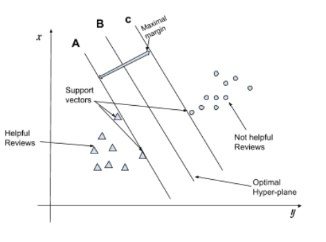
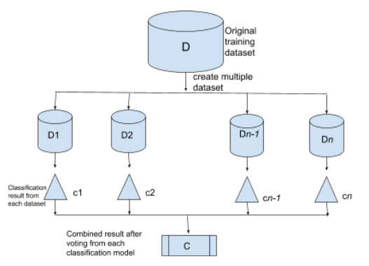
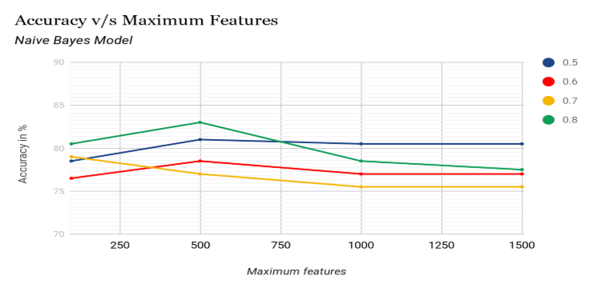
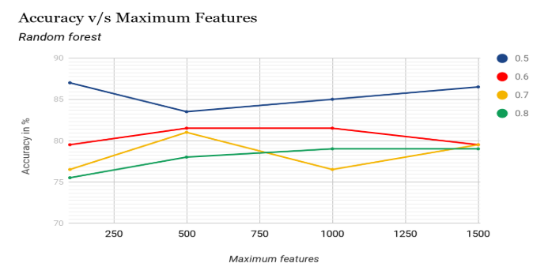
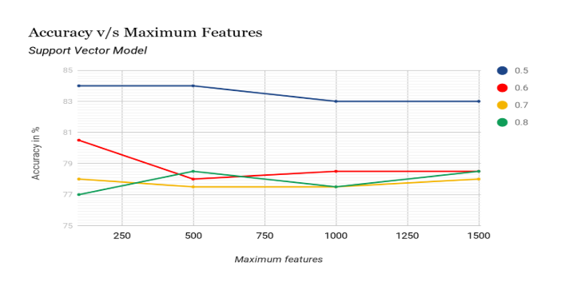

## Prediction of Extent of Helpfulness of Reviews on E-Commerce Websites


In the current models, the old reviews have an advantage because they have the merit of
acquiring a good number of helpfulness votes because they were posted earlier and many
recent reviews are not considered good for not having enough votes and this problem is
addressed in our model.
Our model can not only decide helpfulness of review but can also decide up to what extent a
particular review is helpful by applying different machine learning algorithms.

### Dataset


We have collected the review of mobile “​ **Redmi Note 5 (Black, 64 GB) (4 GB RAM)​** ”​ from the
e-commerce website flipkart.com
Columns of the dataset consist of results of helpfulness as 1(helpful) and 0(not helpful) with
respect to a particular pre-decided value of α


```
α = likes / ( likes + dislikes )
e.g. for the above review value of αis,
α = likes / ( likes + dislikes )
= 55 /( 55 + 10 )
= 0. 846
```

### Methodology


To get the most accurate result from our model and in order to filter the reviews, we do the
following procedures.

### A. Creating a bag of words model


**Tokenization**

**Lowercase Conversion**

**Stemming**

**Stopword removal**

### B. Applying Model


**1. Application of Naive Bayes algorithm**

```
x = set of helpful reviews with respect to a particular value of α
y = set of non-helpful reviews with respect to a particular value of α
```
_s_ be any new review to be tested for a particular value of α and ```s=w1+ w2+.....+wn```
where ```w1, w2,wn``` ,etc are words in a particular review
Now for calculating the probability of a particular review whether it is helpful or not.
```
p(x/s)=p(s/x)*p(s)/p(x)
```
assume ‘​ Naive ​’ condition ​ i.e. ​ every word in a review does not have a dependency on other
words.

Then, ​ ```ps=pw1*pw2*......*pwn```
Finally applying Bayes Theorem,
​ ```p(s/x)=p(w1/x)*p(w2/x)*......*p(wn/x)```

**2. Application of Support Vector Machine algorithm**



**3. Application of Random Forest Algorithm**

In this algorithm, we choose a value for ​ “n_estimators” ​ which decides the number of
decision trees our model will create for classification of reviews.



### Testing And Results

We kept the track of the value of α for each review so that we can predict the extent of the
helpfulness of the review e.g. for one column the parameter of helpfulness is if α>= 0. 5
implies the helpful review then for other columns the parameter is α>= 0. 6 implies the helpful
review and so on up to α>= 0. 9. The review with α>= 0. 9 will be considered then α>= 0. 8
and so on till α>= 0. 5.







**Table: Accuracy for α>= 0. 9 for different models**

| **Maximum features used** | **100** | **500** | **1000** | **1500** |
| --- | --- | --- | --- | --- |
| **Naive Bayes** | 81.5 | 28 | 36.5 | 36.5 |
| **SVM** | 93 | 93 | 91 | 92 |
| **Random Forest** | 94.5 | 94.5 | 94.5 | 94.5 |


## Conclusion


Our model has the capability to create a mutual benefit for both consumers and owners of
e-commerce platforms. With better reviews getting highlighted, customers can improvise
their decisions, and service providers can improve their services in optimized time and thus
developing a deep faith in online services.
